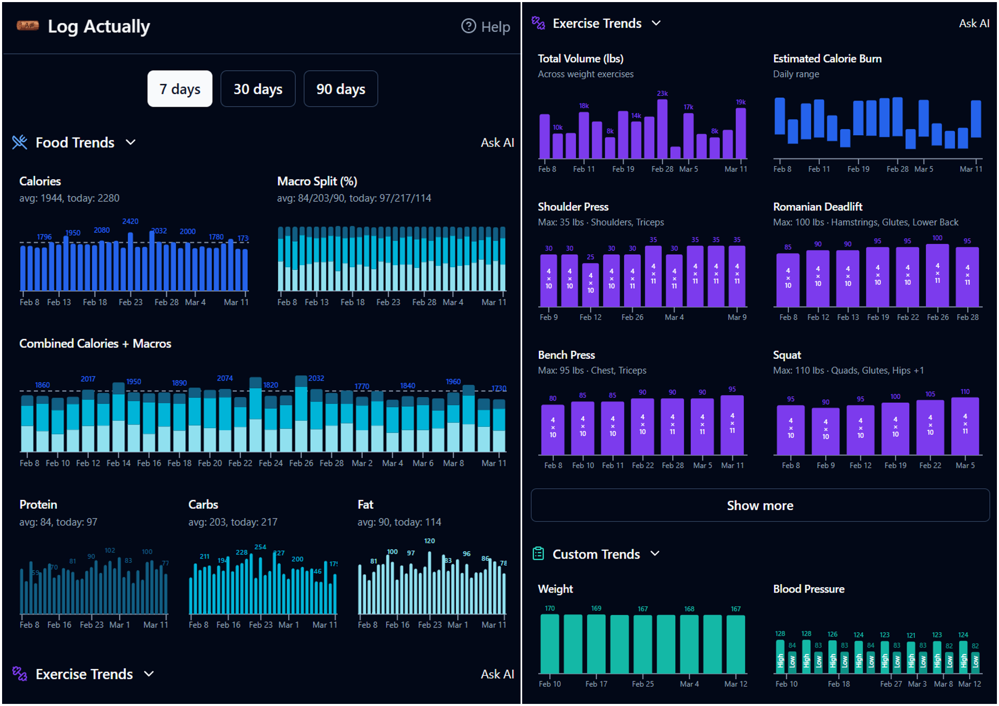

# Log Actually

I'm trying to focus on my health more lately, but every food tracking app I tried drove me nuts — too many taps, too many screens, too much friction... so I built my own. The idea is simple: braindump what you ate in your a stream-of-consciousness way (via text, voice, photo, or scan UPC), and wire it up to AI to turn word salad into structured data with nutritional information. 

Once food tracking was working the way I liked, I added exercise logging (my watch doesn't do a great job tracking weight-lifting workouts). And then custom logs for things like body weight, blood pressure, sleep — classic "if you give a mouse (PM) a cookie (MVP)...".

It has a demo mode if you want to poke around without creating an account - try it out at [logactually.com](https://logactually.com). Also see the changelog at [https://logactually.com/changelog](https://logactually.com/changelog).




## Features

### Food Logging
- **Natural language input** — describe what you ate however you want, AI parses it into items with full macro breakdowns (calories, protein, carbs, fat, fiber, sugar, sodium, cholesterol)
- **Photo-based logging** — snap a picture and AI identifies items
- **Barcode scanning** via camera
- Editable portions with proportional nutrient scaling
- Saved meals for quick re-logging
- Smart suggestions — detects repeated patterns and offers to save them

### Exercise Logging
- **Natural language input** for weight training (e.g. "bench 135 3x8, squats 185 5x5") and cardio
- Estimated calorie burn using MET values from the 2024 Compendium of Physical Activities
- Apple Health import for watch-based workouts
- Saved routines for quick re-logging

### Custom Logs
- Track anything: body weight, blood pressure, sleep, mood, journal entries, etc.
- Numeric, dual-numeric, and text value types
- Built-in templates for common metrics

### Trends and Insights
- Charts for calories, macros, exercise volume, and custom metrics over 7/30/90-day windows
- **"Ask AI"** — query your own logged data in plain language
- Daily calorie target tracking with color-coded indicators

### Other
- Dark mode
- PWA (installable on mobile)
- CSV export
- Demo mode — try it without creating an account
- Imperial and metric unit support

## Tech Stack

- **Frontend:** React, Vite, TypeScript, Tailwind CSS, shadcn/ui
- **Backend:** Supabase — auth, database, edge functions
- **AI:** Google Gemini (via edge functions for food/exercise parsing, photo analysis, trend insights)
- **Charts:** Recharts
- **Barcode scanning:** ZXing
- **Food database:** Open Food Facts (UPC lookups)
- **Exercise data:** 2024 Compendium of Physical Activities (MET-based calorie estimates)

## Getting Started

```sh
git clone <repo-url>
cd log-actually
npm install
```

### Environment Variables

Copy the example env file and fill in your Supabase project details:

```sh
cp .env.example .env
```

Then edit `.env` with your values:

```
VITE_SUPABASE_PROJECT_ID="your-project-id"
VITE_SUPABASE_PUBLISHABLE_KEY="your-anon-key"
VITE_SUPABASE_URL="https://your-project-id.supabase.co"
```

You can find these in your Supabase project's **Settings → API** page.

### Supabase Setup

This app requires a Supabase project with the schema defined in `supabase/migrations/`. To apply the schema:

1. Install the [Supabase CLI](https://supabase.com/docs/guides/cli)
2. Link your project: `supabase link --project-ref your-project-id`
3. Push migrations: `supabase db push`

You'll also need to configure the following in your Supabase project:
- **Auth:** Enable email/password sign-ups
- **Edge Functions:** Deploy the functions in `supabase/functions/` (they require an `OPENAI_API_KEY` secret or equivalent AI provider key)

### Run

```sh
npm run dev
```

## Project Structure

```
src/
  pages/        — Route-level page components
  components/   — Reusable UI components
  hooks/        — Custom React hooks (data fetching, auth, etc.)
  lib/          — Utility functions and constants
  types/        — TypeScript type definitions
supabase/
  functions/    — Edge functions (AI analysis, barcode lookup, etc.)
  migrations/   — Database schema migrations
```

## License

MIT
