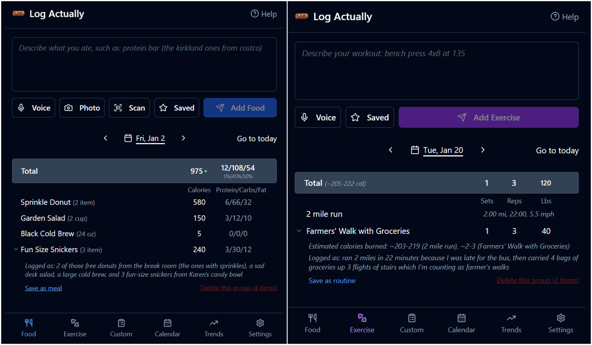
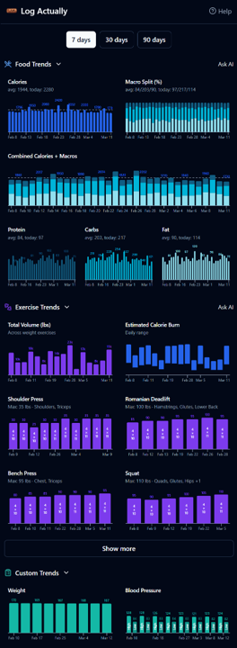

# Log Actually

AI-powered food, exercise, and custom metric logging. Braindump what you ate (or lifted), and AI handles the nutrition math and exercise tracking.





## Tech Stack

- **Frontend:** React, Vite, TypeScript, Tailwind CSS, shadcn/ui
- **Backend:** Supabase — auth, database, edge functions
- **Charts:** Recharts

## Getting Started

```sh
git clone <repo-url>
cd log-actually
npm install
```

### Environment Variables

Copy the example env file and fill in your Supabase project details:

```sh
cp .env.example .env
```

Then edit `.env` with your values:

```
VITE_SUPABASE_PROJECT_ID="your-project-id"
VITE_SUPABASE_PUBLISHABLE_KEY="your-anon-key"
VITE_SUPABASE_URL="https://your-project-id.supabase.co"
```

You can find these in your Supabase project's **Settings → API** page.

### Supabase Setup

This app requires a Supabase project with the schema defined in `supabase/migrations/`. To apply the schema:

1. Install the [Supabase CLI](https://supabase.com/docs/guides/cli)
2. Link your project: `supabase link --project-ref your-project-id`
3. Push migrations: `supabase db push`

You'll also need to configure the following in your Supabase project:
- **Auth:** Enable email/password sign-ups
- **Edge Functions:** Deploy the functions in `supabase/functions/` (they require an `OPENAI_API_KEY` secret or equivalent AI provider key)

### Run

```sh
npm run dev
```

## Project Structure

```
src/
  pages/        — Route-level page components
  components/   — Reusable UI components
  hooks/        — Custom React hooks (data fetching, auth, etc.)
  lib/          — Utility functions and constants
  types/        — TypeScript type definitions
supabase/
  functions/    — Edge functions (AI analysis, barcode lookup, etc.)
  migrations/   — Database schema migrations
```

## License

MIT
